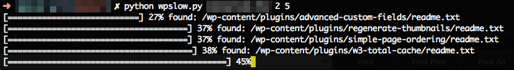

# WPSLOW
A slow wordpress plugin vulnurability scanner for pwning Bluehost/Dreamhost WAF 

# DESCRIPTION
wpslow - a slow wordpress plugin vulnurability scanner for pwning Bluehost/Dreamhost WAF (Web Application Firewall) by using random timing for requests and random user-agents. 

# INSTALL 
copy into your wpscan folder 

# USAGE 
  $ python wpslow.py targeturl:port minpause maxpause 

:port is optional
minpause and maxpause are delays between requests in seconds

# EXAMPLES 
  $ python wpslow.py localhost:8000 2 5

  $ python wpslow.py wordpress.com 2 5

# DEPENDENCIES 
wpscan plugins.json vulnerable plugin list

# NOTES
By default this script only looks for the plugins tagged 'popular' by wpscan to speed things up
		